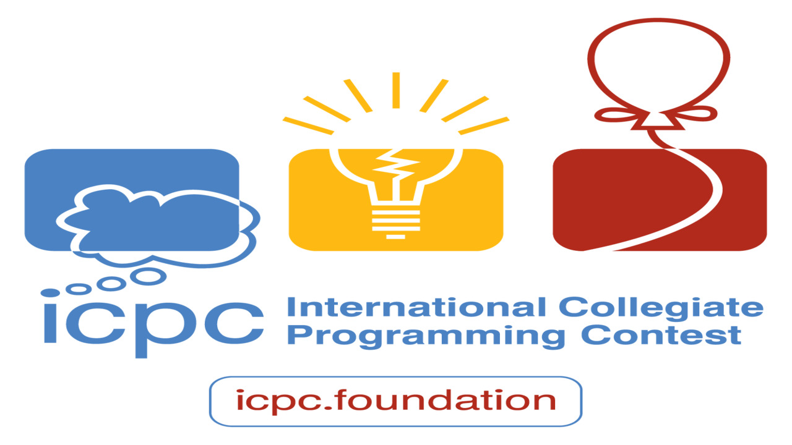
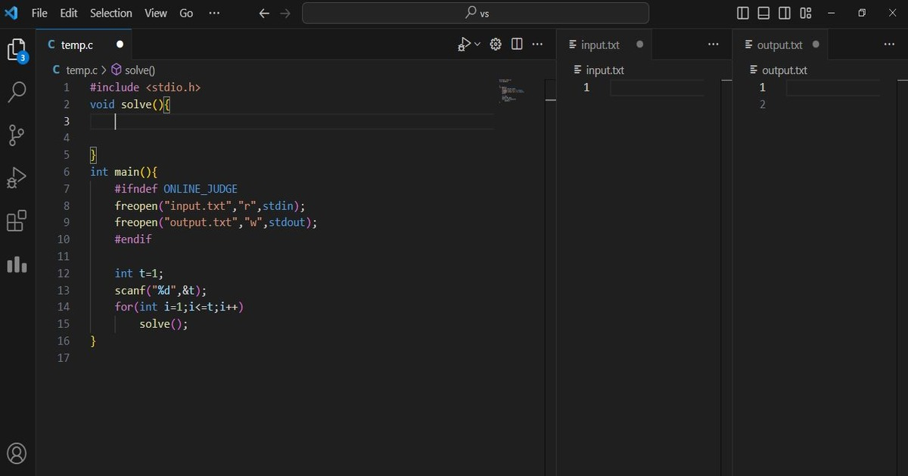
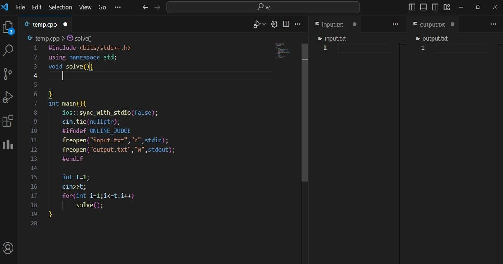
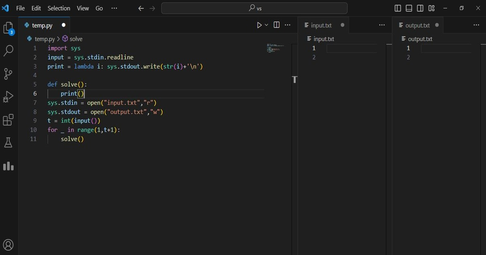

# আইসিপিসির জন্য  কিভাবে প্রস্তুতি নেওয়া উচিত ?
এসিএম আন্তর্জাতিক কলেজিয়েট প্রোগ্রামিং প্রতিযোগিতা (এসিএম আইসিপিসি বা আইসিপিসি) হলো একাধিক ধাপবিশিষ্ট বার্ষিক প্রোগ্রামিং প্রতিযোগিতা যা সারা বিশ্বের বিশ্ববিদ্যালয়গুলোর মধ্যে অনুষ্ঠিত হয়।
আইসিপিসি বিশ্ববিদ্যালয় পর্যায়ের শিক্ষার্থীদের জন্য কম্পিউটার প্রোগ্রামিং সমস্যা সমাধানের সবচেয়ে সম্মানজনক ও মর্যাদাপূর্ণ।

<center>

</center>


#  সিপি কিভাবে শুরু করবো ?
শুরুতে যেকোনো একটা ল্যাংগুয়েজের ব্যাসিক শিখতে হবে। ম্যাক্সিমাম  সি প্লাস প্লাস প্রেফার করে  । আর 
প্রবলেম প্রাকটিস করার জন্য ভিএস কোড অনেক  জনপ্রিয় । অনেক এক্সটেনশন ও সুবিধা থাকায় অনেক সলভারই vs code ব্যবহার করেন। আর প্রোগ্রাম সলভ করার সময়  আমরা কিছু জিনিস বার বার লিখি। সেজন্য যাতে বার বার না লিখা লাগে আমরা সে কোডকে টেমপ্লেট আকারে রেখে দিতে পারি। যেমন - কিছু সিম্পল টেমপ্লেট :

=== "C"
    ```c
    #include <stdio.h>
    void solve(){
       
    
    }
    int main(){
        #ifndef ONLINE_JUDGE
        freopen("input.txt","r",stdin);
        freopen("output.txt","w",stdout);
        #endif
         
        int t=1;
        scanf("%d",&t);
        for(int i=1;i<=t;i++)  
            solve();
    }
    
    ```
=== "C++"
    ```cpp
    #include <bits/stdc++.h>
    using namespace std;
    void solve(){
    

    }
    int main(){
        ios::sync_with_stdio(false);
        cin.tie(nullptr);
        #ifndef ONLINE_JUDGE
        freopen("input.txt","r",stdin);
        freopen("output.txt","w",stdout);
        #endif

        int t=1;
        cin>>t;
        for(int i=1;i<=t;i++)  
            solve();
    }
    ```
=== "Python"
    ```py
    import sys
    input = sys.stdin.readline
    print = lambda i: sys.stdout.write(str(i)+'\n')
 
    def solve():
        print()
    sys.stdin = open("input.txt","r")
    sys.stdout = open("output.txt","w")
    t = int(input())
    for _ in range(1,t+1):
        solve()
    ```


<center>

</center>
<center>

</center>
<center>

</center>

# কোড লিখায় করনীয়
- প্রবলেমের আউটপুটের শেষে প্রায় সময়  আমরা নিউ লাইন এড করতে ভুলে যাই। যেজন্য এই সামান্য জিনিসটাই অনেক বড় বিপদের কারন হয়ে দাঁড়ায়।তাই প্রিন্ট করার সময়  খেয়াল রাখতে হবে "\n" এর উপর।
- C++ এ endl এর বদলে "\n" ব্যবহার করা উচিত।
- while লুপের বদলে for লুপ ব্যবহার করা উচিত।
- রিকার্সিভ এপ্রোচের বদলে ইটারেটিভ এপ্রোচ ফলো করা।
- বিটমাক্স দিয়ে যদি অপেরেশন করা যাই, বিটমাক্স ব্যবহার করাই বেটার।
- সবথেকে বড় জটিলতা আসে ইনপুট আউটপুটের পরিমান যদি অনেক বেড়ে যাই। সেজন্য অবশ্যই প্রতিটি কোডে ফাস্টার আই/ও ব্যবহার করতে হবে।
=== "C++"
    ```cpp
    #include <bits/stdc++.h>
    using namespace std;
    int main(){
        ios::sync_with_stdio(false);
        cin.tie(nullptr);
    }
    ```
=== "Python" 
    ```py
    import sys
    input = sys.stdin.readline
    print = lambda i: sys.stdout.write(str(i)+'\n')
    ```


# কনটেস্টের আগে  প্রাক-প্রস্তুতি
- প্রতিনিয়ত নতুন কনসেপ্ট শেখা এবং ঐ কনসেপ্টের দু একটা প্রবলেম ( সহজ থেকে ধীরে ধীরে কঠিন) সলভ করা। অনুশীলনের কোনো বিকল্প নেই। যেমন আজ ডায়নামিক প্রোগামিং শিখলাম, আগে যেসব রিকার্সিভ প্রবলেম সলভ করেছি সেগুলো ডিপি স্টাইলে সলভ করার চেষ্টা করবো।
- অন্যের কোড কপি না করা। বরং কোড করার আগে লজিকটি লিখে তারপর নিজে নিজেই সুডোকোড অনুযায়ী প্রবলেম সলভ করার চেষ্টা করা।
- প্রবলেম সেটায় সলভ করা উচিত যেটার ব্যাপারে আমার ধারনা আছে। যেমন আমি গ্রাফ থিওরী জানি না। সেক্ষেত্রে আমার এ টাইপের প্রবলেম নিয়ে চিন্তা করাটাই বোকামি। প্রাকটিস করার পাশাপাশি নতুন সব অ্যালগরিদম, ডাটা স্ট্রাকচার শিখতে হবেই।
- কোডফোর্সেস এর মত শর্ট কনটেস্ট এ পার্টিসিপেট করা।
- জটিলতা থেকে দূরে থাকা। প্রবলেম যদি সহজেই সলভ করা যাই আর টাইম কম্প্লেসিটি অনেক থাকে, জটিলতায় গিয়ে টাইম নষ্ট করার কোনো মানে নেই।
- সহজ থেকে কঠিনে আগানো। শুধু সহজ প্রবলেম নিয়ে পড়ে থাকলে হবে না। কঠিনে যেতে হবে। না বুঝলে এডিটরিয়াল দেখতে হবে।
- বিভিন্ন জিয়ান্ট টেক কোম্পানির আগের কোডিং ভাইভাগুলো থেকে অ্যালগরিদম প্রাকটিস করা।


# কনটেস্ট চলাকালীন 
- সবথেকে সহজ প্রবলেম দিয়ে শুরু করা।
- প্রবলেমটি কমপক্ষে দুইবার পড়া।
- প্রবলেম এনালাইসিস করা ।
- ইনপুট আউটপুট প্যাটার্ন মাথায় রেখে বার বার
  প্রবলেমটি পড়ে কনসেপ্ট বোঝার চেষ্টা করা।
- লজিক ডেভলপ করার জন্য অবশ্যই কলম ও কাগজ ব্যবহার করা।
- প্রবলেমের কন্সট্রাকশনগুলো মনযোগ সহকারে পড়া।
- প্রবলেমের টাইম কম্প্লেসিটি সম্পর্কে সতর্ক থাকা।
- সময় সম্পর্কে সচেতন হওয়া ।
- প্রবলেম যদি এক্সেপ্টেড না হয়, নিজে কিছু টেস্ট কেস বানিয়ে লজিকের ভুলগুলো চেক করা।
  
# কনটেস্টের পর
- এডিটরিয়াল সাথে নিজের কোডের ইফিসিয়েন্সি কমপেয়ার করা।
- আনসল্ভড প্রবলেমগুলো এডিটরিয়াল দেখে প্রাকটিস করা।
- পূর্বের কনটেস্টগুলোর ভুলগুলো থেকে শিক্ষা নেওয়া ।
হ্যাপি কোডিং 🙂
