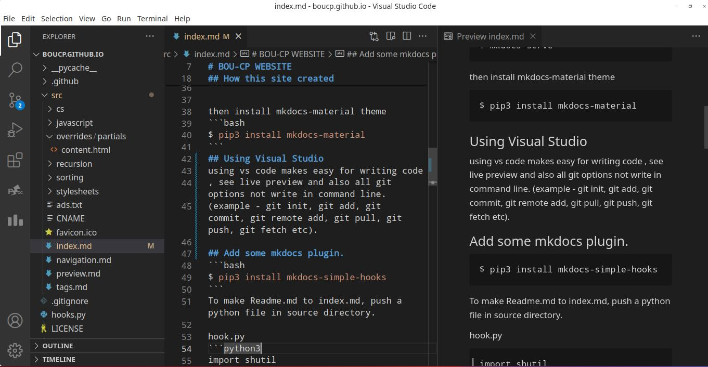
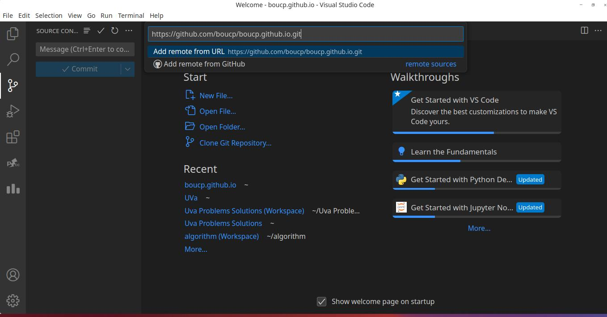
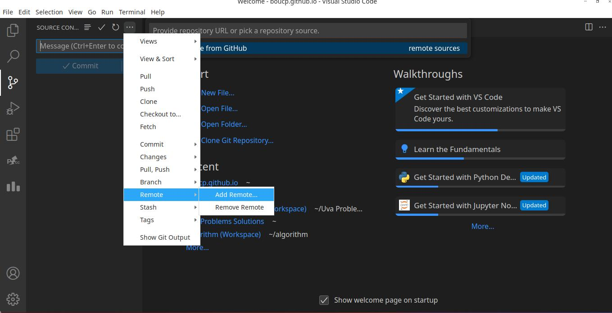
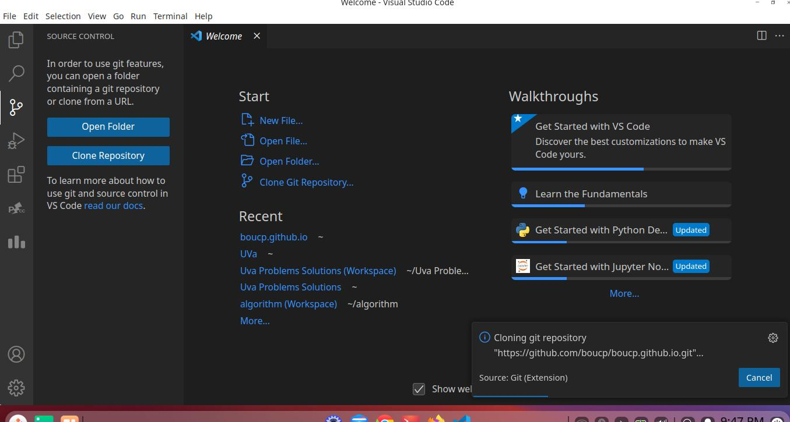
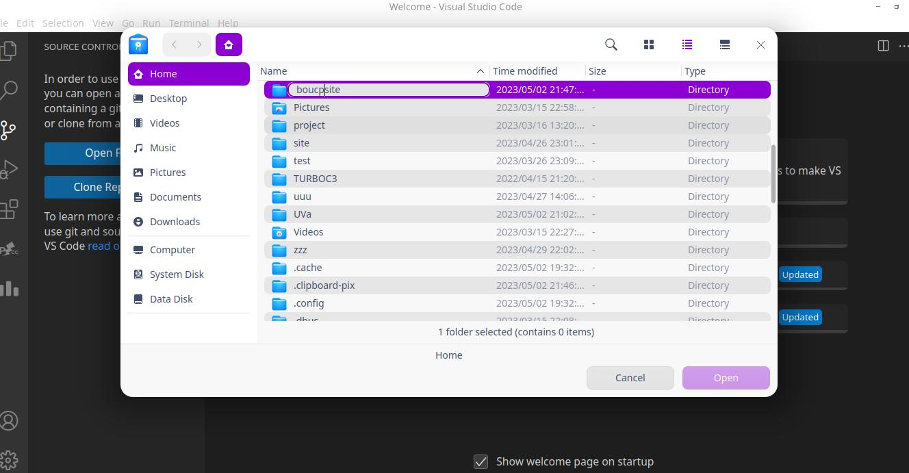
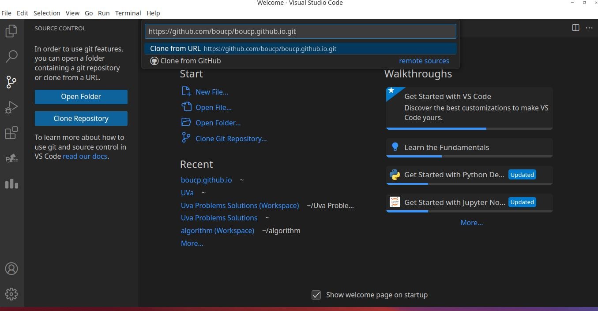
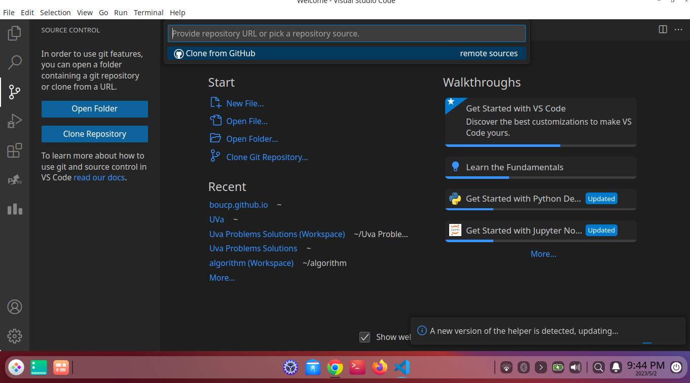

# BOU-CP WEBSITE

[](https://github.com/boucp/boucp.github.io/graphs/contributors)
[](https://github.com/boucp/boucp.github.io/pulls)
[](https://github.com/boucp/boucp.github.io/pulls?q=is%3Apr+is%3Aclosed)
[](https://github.com/boucp/boucp.github.io/actions/workflows/build.yml)
[](https://github.com/boucp/boucp.github.io/wiki/Translation-Progress)


This site is mainly created for storing and gathering the main topic about algorithm, data structure and related problems..

## How this site created
Thanks to mkdocs and mkdocs-material open source python developers.
This site is created only by python packages.
There are a lot of ways to build and deploy mkdocs static site.
This is one of the simplest ways to build and deploy in github.  
first install python and then install pip in terminal.
then install mkdocs.
```bash
$ pip3 install mkdocs
```
Then make a site and enter those folder.
```bash
$ mkdocs new site
$ cd site
```
Then to  see local website view.
```bash
$ mkdocs serve
```

then install mkdocs-material theme
```bash
$ pip3 install mkdocs-material
```
## Using Visual Studio 
using vs code makes easy for writing code
, see live preview and also all git options not write in command line.
(example - git init, git add, git commit, git remote add, git pull, git push, git fetch etc).
<center>

</center>
<center>

</center>

</center>
<center>

</center>

</center>
<center>

</center>

</center>

## Add some mkdocs plugin.
```bash
$ pip3 install mkdocs-simple-hooks
```
To make Readme.md to index.md, push a python file in source directory.

hook.py
```python3
```python3
import shutil

def copy_readme(*args, **kwargs):
    shutil.copy("README.md", "src/index.md")
```


## Add plugins in mkdocs.yml
```yml
plugins:
  - search
  - mkdocs-simple-hooks:
      hooks:
        on_pre_build: "hooks:copy_readme"

```
Then edit some minor things in mcdocs.yml.
## Theme modification in mkdocs.yml

```yml

theme:
   name: material
   palette:
    # Palette toggle for automatic mode
    - media: "(prefers-color-scheme)"
      toggle:
        icon: material/brightness-auto
        name: Switch to light mode
    # Palette toggle for light mode
    - media: "(prefers-color-scheme: light)"
      scheme: default 
      toggle:
        icon: material/brightness-7
        name: Switch to dark mode
    # Palette toggle for dark mode
    - media: "(prefers-color-scheme: dark)"
      scheme: slate
      toggle:
        icon: material/brightness-4
        name: Switch to system preference
  icon:
    repo: fontawesome/brands/github
    edit: material/pencil-box-outline
    view: material/eye
  features:
    - navigation.tracking
    - navigation.tabs
    - toc.integrate
    - search.suggest
    - content.action.edit
    - content.action.view
```
  
## Markdown modification
```yml
    markdown_extensions:
  - pymdownx.arithmatex:
      generic: true
      tex_inline_wrap: ['$', '$']
      tex_block_wrap: ['$$', '$$']
  - pymdownx.highlight
  - admonition
  - pymdownx.details
  - pymdownx.superfences
  - pymdownx.tabbed:
      alternate_style: true
  - attr_list
  - pymdownx.emoji:
      emoji_index: !!python/name:materialx.emoji.twemoji 
      emoji_generator: !!python/name:materialx.emoji.to_svg
  - meta
```
## Make a shell script for installing pip packages
Installed extra pakages except mkdocs-simple-hooks for later updates in this site.
```bash
  #!/bin/bash

  pip3 install \
    mkdocs-material \
    mkdocs-macros-plugin \
    mkdocs-literate-nav \
    mkdocs-git-authors-plugin \
    mkdocs-git-revision-date-localized-plugin \
    mkdocs-simple-hooks \
    mkdocs-git-committers-plugin-2
```
