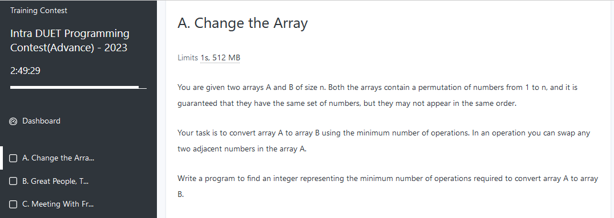
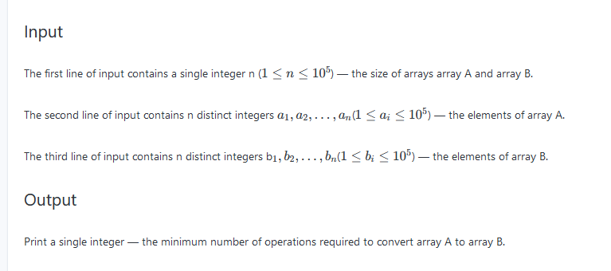
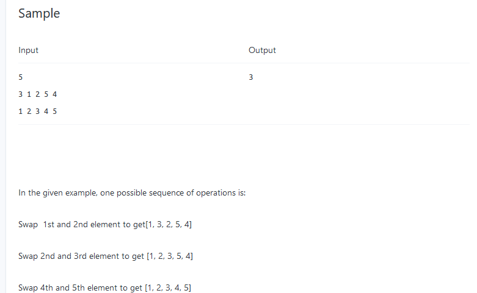

# Live

শুরুতে বলা হয়েছে আমাকে n সাইজের দুইটা অ্যারে a আর b দেয়া হলো। প্রতিটি অ্যারেতেই ১ থেকে n  পর্যন্ত স্বাভাবিক সংখ্যার পারমুউটেশন আছে। দুটো অ্যারেটেই সেম সেটের সংখ্যা আছে কিন্ত এলোমেলোভাবেও থাকতে পারে আবার নাও পারে।
আমার কাজ হচ্ছে সর্বনিম্ন কম অপারেশন করে a কে b এর মতো করে ফেলতে। a যদি [১,৩,২,৪] হয় b যদি [৪,২,১,৩] হয় আমাকে a কে [৪,২,১,৩] বানাতে হবে। আর এক একটা অপারেশন ও আমি কি কি করতে পারবো? আমি শুধু a এর মধ্যকার পাশাপাশি দুই সংখ্যার স্থান অদল-বদল করতে পারবো। 

আমাকে এটারই প্রোগ্রাম লিখতে হবে যেটাতে সর্বনিম্ন অপারেশন বের করে দিবে।

ইনপুটে থাকবে n যেটার মান ১ থেকে ১ লাখ পর্যন্ত হতে পারে। পরে n সাইজের দুটি অ্যারে থাকবে। প্রতিটি অ্যারের উপাদান ১ থেকে ১ লাখের মধ্যেই হতে পারে।

আমাকে আরো ক্লিয়ার বুঝানো জন্য একটা সেম্পল দেখালো, যেখানে তিনটা অপারেশন বা পাশাপাশি সোয়াপিং করা লাগছে। 

