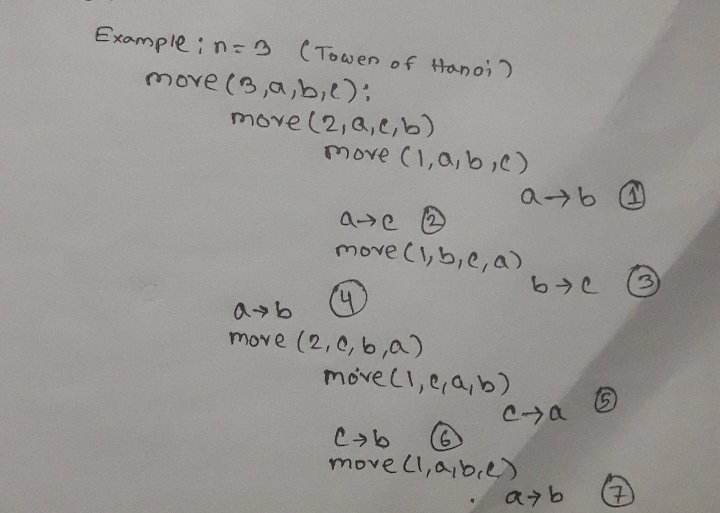

---
tags:
  - রিকার্সিভ 
  - স্ট্যাক
  - পাজল
---

# হ্যানয়ের টাওয়ার সমস্যা 
Pre-requisite topic:

  - Recursion  
  - Stack

Tower of Hanoy বা হ্যানয়ের টাওয়ার এমন একটি পাজল যেখানে সাধারনত তিনটি খুঁটি এবং বিভিন্ন আকারের কিছু সংখ্যাক ডিস্ক স্ট্যাক আকারে সাজানো থাকে। এই পাজলের মূল উদ্দেশ্য হল সম্পূর্ণ স্ট্যাকটিকে প্রথম খুঁটি থেকে তৃতীয় খুঁটিতে নিয়ে যাওয়া।
তবে ডিস্ক সরানোর ক্ষেত্রে কয়েকটি ব্যাপার মাথায় রাখতে হবে:

  - একবারে শুধুমাত্র একটি ডিস্ক সরানো যাবে।
  - প্রতিটি পদক্ষেপে একটি স্ট্যাকের উপরের ডিস্কটি নেওয়া যাবে এবং এটিকে অন্য স্ট্যাকের উপরে বা একটি খালি মেরুতে স্থাপন করা যাবে। 
  - একটি ছোট ডিস্কের উপরে কোন বড় ডিস্ক স্থাপন করা যাবে না। 

এই পাজলটি সমাধান করার জন্য আমরা একটি রিকার্সিভ অ্যালগরিদম ব্যবহার করতে পারি। 


## অ্যালগরিদম 
- ধাপ ১: n-1 সংখ্যক ডিস্ক সোর্স থেকে অতিরিক্ত পিলারে রাখা।
- ধাপ ২: n তম ডিস্ক সোর্স থেকে টার্গেট পিলারে রাখা।
- ধাপ ৩: n-1 সংখ্যক ডিস্ক  অতিরিক্ত পিলার থেকে টার্গেটে রাখা। 
## সুডোকোড 
```cpp
Procedure move(disks,source,target,extrapole)
    if disks > 1 then do
            # move n-1 disks to extrapole from source.
            move(disks-1,source,extrapole,target) // head recursion
            write source to new_target
    if disks = 1 then do
           # move n-th disk to target from source.
           write source to target
    if disks >1 then do
           # move n-1 disks to target from ectrapole.
           move(disks-1,extrapole,target,source) // tail recursion
 END
```
<center>

</center>

## ইম্প্লিমেন্ট 
=== "C"
    ```c
    
    void move(int n,char a,char b,char c)
    {
       if(n>1)
      {
          move(n-1,a,c,b);
         printf("%c to %c\n",a,b);
      }
     if(n==1)
      {
          printf("%c to %c\n",a,b);
      }
      if(n>1)
      {
          move(n-1,c,b,a);
      }
    }
    
    ```
=== "C++"
    ```cpp
    
    void move(int n,char a,char b,char c)
    {
        if(n>1)
       {
           move(n-1,a,c,b);
           cout<<a<<" to "<<b<<endl;
       }
      if(n==1)
      {
           cout<<a<<" to "<<b<<endl;
      }
      if(n>1)
      {
          move(n-1,c,b,a);
      }
    }
    
    ```
=== "Python"
    ```python3
    def move(n,a,b,c):
    if n>1:
        move(n-1,a,c,b)
        print(a+" to "+b)
    if n==1:
        print(a+" to "+b)
    if n>1:
        move(n-1,c,b,a)
    ```
=== "Java"
    ```java
    
    public static void move(int n,char a,char b,char c)
    {

       if (n > 1)
       {
         move(n - 1, a, c, b);
         System.out.println(a+" to "+b);
       
     }
        if (n == 1)
        {
            System.out.println(a+" to "+b);
        
        }
        if (n > 1)
     {
            move(n - 1, c, b, a);
        }
    }

    ```
## স্পেস/ টাইম কম্প্লেক্সিটি
- টাইম কম্প্লেক্সিটি: O(2^n)
- স্পেস কম্প্লেক্সিটি: O(n)

## কিছু সমস্যা ও সমাধান 
- [10017 - The Never Ending Towers of Hanoi](https://onlinejudge.org/index.php?option=com_onlinejudge&Itemid=8&page=show_problem&problem=958)
    - [Solution](https://github.com/soyritu/UVa/blob/master/10017%20The%20Never%20Ending%20Towers%20of%20Hanoi%20-%20Online%20Judge.py)
- [UVa 254 - Towers of Hanoi](https://onlinejudge.org/index.php?option=onlinejudge&Itemid=8&page=show_problem&problem=190)
- [UVa 10276 - Hanoi Tower Troubles Again!](https://onlinejudge.org/index.php?option=onlinejudge&Itemid=8&page=show_problem&problem=1217)
